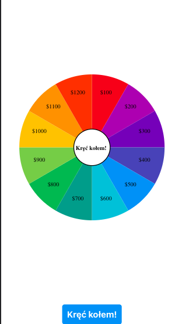
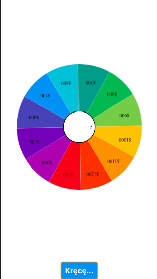

# Wheel of Fortune
This is a simple "Wheel of Fortune" game built with React. The game consists of a spinning wheel with multiple sections, each containing a reward. The user can click the "Spin" button to start spinning the wheel, which will eventually stop at a random section, revealing the reward for the user.





## Installation
To run the project locally, clone the repository and install dependencies using the following commands:

```

git clone https://github.com/your-username/wheel-of-fortune.git
cd wheel-of-fortune
yarn

```

### Usage
To start the development server, run the following command:

```
yarn start
```
This will start the development server at http://localhost:3000. Open this URL in your browser to play the game.

## How to Play
- Click the "Spin" button to start spinning the wheel.
- Wait for the wheel to stop spinning.
- The section where the wheel stopped spinning will reveal the reward for the user.
## Customization
You can customize the rewards and their colors by editing the rewards array in the src/App.js file. You can also customize the wheel's appearance by modifying the styles in the src/components/Wheel.js file.

## License
This project is licensed under the MIT License. 